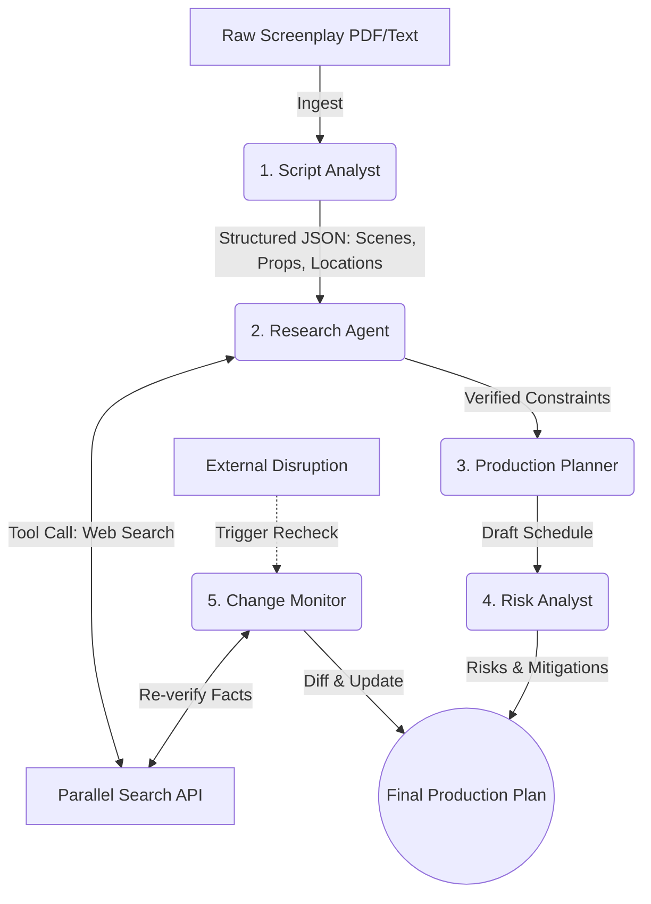

# 🎬 StudioPilot

[](https://opensource.org/licenses/MIT)
[](https://cloud.google.com/)
[](https://deepmind.google/technologies/gemini/)

**StudioPilot** is a Gemini-powered AI production coordinator that turns unstructured screenplays into living, continuously verified production plans for independent filmmakers and small production teams. 

Instead of spending weeks manually breaking down scripts, researching permits, and building schedules, StudioPilot uses a deterministic multi-agent network to automate the entire pre-production workflow in minutes.

---

## 🏗️ Architecture & Data Flow

StudioPilot operates as a deterministic pipeline of five specialized AI agents orchestrated via the **Google Agent Development Kit (ADK)**.



### Agent Roles:
1. **Script Analyst:** Ingests raw text/PDFs, robustly handling messy formatting to extract structured scenes, characters, locations, props, and dependencies.
2. **Research Agent:** Analyzes extracted requirements and uses forced function calling to query the **Parallel Search API** for real-world constraints (e.g., weather, permits, equipment rules).
3. **Production Planner:** Synthesizes script data and research findings into an optimized, location-grouped shooting schedule.
4. **Risk Analyst:** Evaluates the schedule for logistical bottlenecks and safety hazards, providing actionable mitigations.
5. **Change Monitor:** On-demand agent that re-runs previous Parallel searches to detect real-world changes (e.g., revoked permits, sudden storms) and dynamically patches the schedule.

---

## 🛠️ Tech Stack

* **AI Orchestration:** Google Agent Development Kit (ADK) (Python)
* **LLM:** Google Gemini (`gemini-2.5-flash`) via `@google/genai`
* **Web Research:** Parallel Search API
* **Frontend:** Next.js, React 18, Tailwind CSS, Lucide Icons
* **Deployment:** Google Cloud Run
* **Secrets Management:** Google Cloud Secret Manager

---

## 🧠 Key Integrations

### Google Gemini & ADK
StudioPilot relies entirely on `gemini-2.5-flash` for reasoning, extraction, and planning. The pipeline uses **Structured Outputs (JSON Schema)** at every step to ensure a strict, deterministic contract between agents. The ADK orchestrates the handoffs, ensuring the Research Agent doesn't start until the Script Analyst has successfully parsed the PDF.

### Parallel Search API (Partner Integration)
The Research Agent is equipped with a `parallelSearch` tool. We use **Forced Function Calling** (`mode: 'ANY'`) triggered by specific script elements (e.g., `EXT` locations, weapons, vehicles). 
* **Initial Run:** Parallel fetches real-time permit requirements, historical weather, and equipment regulations.
* **Change Monitor (Recheck):** Parallel is re-queried against the *exact same topics* later. The agent diffs the new Parallel response against the cached response to detect disruptions (e.g., a sudden storm warning) and updates the schedule accordingly.

---

## 🚀 Setup & Deployment

### Prerequisites
* Google Cloud Project with billing enabled.
* Gemini API Key.
* Parallel Search API Key.

### Local Development
1. Clone the repository:
   ```bash
   git clone https://github.com/yourusername/studiopilot.git
   cd studiopilot
   ```
2. Install dependencies:
   ```bash
   npm install
   ```
3. Set up your environment variables in a `.env` file:
   ```env
   API_KEY=your_gemini_api_key
   PARALLEL_API_KEY=your_parallel_api_key
   ```
4. Run the development server:
   ```bash
   npm run dev
   ```

### Google Cloud Run Deployment
This project is designed to be deployed as a decoupled Next.js frontend and Python ADK backend on Cloud Run.

1. **Store Secrets:**
   Add your API keys to Google Cloud Secret Manager.
2. **Deploy Backend:**
   ```bash
   gcloud run deploy studiopilot-backend \
     --source ./backend \
     --region us-central1 \
     --allow-unauthenticated \
     --set-secrets="GEMINI_API_KEY=GEMINI_API_KEY:latest,PARALLEL_API_KEY=PARALLEL_API_KEY:latest"
   ```
3. **Deploy Frontend:**
   ```bash
   gcloud run deploy studiopilot-frontend \
     --source ./frontend \
     --region us-central1 \
     --allow-unauthenticated \
     --set-env-vars="NEXT_PUBLIC_BACKEND_URL=https://studiopilot-backend-xxx.a.run.app"
   ```

---

## 📄 License

This project is licensed under the MIT License - see the [LICENSE](LICENSE) file for details. (Open Source requirement confirmed).
